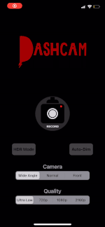
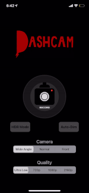
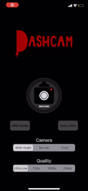
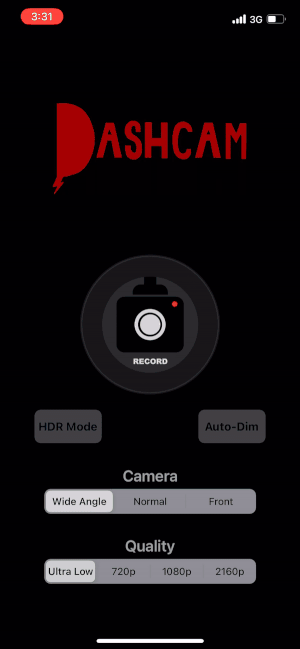

# Dash-Cam

Dash Cam is an iOS Application built using `AVFoundation` that allows users to record car & bike trips using just their iPhone. Great for short commutes in and out of busy cities where small bumper-to-bumper accidents are most common, but often hardest to prove without video evidence. While many often fork over 100's of dollars for a camera that can only record video a fraction of the quality an iPhone can, Dash Cam aims to provide this functionality for free. Our app also offers features that many of the competitors cannot, such as background audio pass through which enables users to continue listening to their music/podcasts/phone calls whilst recording. The app also supports the Wide Angle Camera on newer iPhone models allowing for a larger view to be captured. These features and many more mentioned below make Dash Cam one of the best transportation recording devices for iPhone.

## Features

- Choose between 720p, 1080p, 2160p and Ultra Low video recording resolutions
- Choose between the Wide Angle, Standard, Telephoto and Front cameras on supported devices
- Supports Apple Video Image Stabilization
- Use CoreLocation to tag videos with location
- Automatically end recording when you arrive at your destination
- Record video in 10-Bit HDR for supported devices
- Play audio (i.e. Music and Podcasts) through iPhone while still recording
- Record exterior audio through built-in micrphone
- Automatically dim iPhone screen while recording to save battery and limit distractions
- Video files automatically uploaded to iCloud if enabled
- Easy to use UI with simple and recognizable controls

## Demo

- Customize video resolution, camera selection, HDR Mode and Auto-Dim display settings all from the home screen

   

- UI Walkthrough

- Capture videos easily with the click of a button
  - The 1st video is from the app view finder, the 2nd Video is the file exported from Dash Cam

 
\
\
  

## To Do List

- Add the speed of vehicle to the screen while recording a video
- Place the current time and speed of vehicle directly onto the exported .mov file
- Add Apple Maps integration directly into the Dash Cam
- Allow users to lock video files and store directly on the app rather than within iCloud Photo Library
